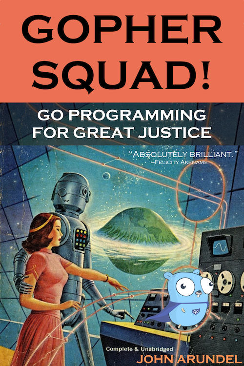

# Gopher Squad 1: Cracking the Carbon Code

This repository contains the code examples for the book [Gopher Squad 1: Cracking the Carbon Code](https://bitfieldconsulting.com/books/), by John Arundel (coming soon).

*THIS BRIEFING DOCUMENT IS CLASSIFIED 'ULTRA TOP SECRET' AND WILL SELF-DESTRUCT AFTER READING*.

Hello, and welcome to Gopher Squad, a top-secret group of the world's best software engineers. Together, as the saying goes, we fight crime.

We've invited you to join us so that you can use your skills with the Go programming language to help in our secret battle with the forces of international crime. You'll be called upon to undertake a number of highly confidential missions, both on Earth, and in space, where our success or failure will depend on your code.

You must now decide whether you wish to join the squad, or turn down the offer. It's up to you.

If you decide not to help, close this document now and you can return to your normal, civilian life (and, to thank you for your time, cake will be served immediately).
